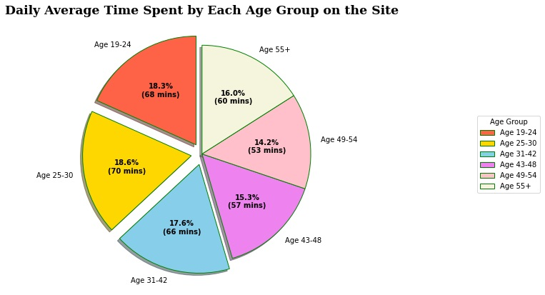
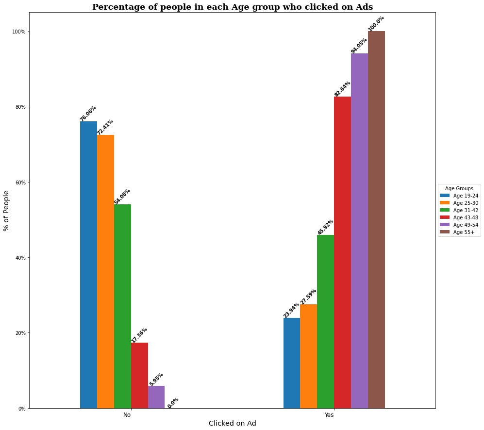

# Ad-Click-Prediction
## Logistic Regression

**Reeva Bhatkal** 

## Business problem:

A marketing agency wants to understand the features of a user who are likely to click on an advertisement. Using a machine learning algorithm we will develop a prediction model, that predicts if a particular user will click on an advertisement or not. 

## Data:
The following dataset was obtained from Kaggle.
Kaggle: https://www.kaggle.com/datasets/gabrielsantello/advertisement-click-on-ad/code
The dataset contains 1000 observations with 10 features.

Here is the Data Dictionary for this dataset:

| Variable Name               | Description |
| ----------------------------|:-------------:|
| Daily Time Spent on a Site  | Time spent by the user on a site in minutes    |
| Age                         | Customer's age in terms of years     |
| Area Income                 | Average income of geographical area of consumer   |
| Daily Internet Usage        | Average minutes in a day consumer is on the internet     |
| Ad Topic Line               | Headline of the advertisement    |
| City                        | City of the consumer     |
| Male                        | Whether or not a consumer was male     |
| Country                     | Country of the consumer     |
| Timestamp                   | Time at which user clicked on an Ad or the closed window     |
| Clicked on Ad               | 0 or 1 is indicated clicking on an Ad     |

*Note: Please note that the data may have missing values. If missing values exist, we will be required to treat missing values accordingly.

## Methodology
1. Use pandas library to perform data cleaning: 
    1. Check for duplicate values
    2. Identifying and handling missing values 
    3. Look for outliers in the dataset
2. Adding more features to our dataset using Feature Engineering techniques
3. Create Exploratory Data Analysis on the data using pandas.
4. Create Explanatory visualization of feature distributions and correlation using matplotlib, seaborn and pandas
5. Build logistic regression models on selected features and target variable  
    1. Identify types of features (Numeric, Nominal)
    1. Transform each type of feature for machine learning
    1. Use StandardScalar to scale our data.
    1. Use OneHotEncoder() to one-hot encode nominal categorical features.
    1. Use ColumnTransformer to perform different strategies on different columns types
    1. Combine pipelines and column transformers to perform multiple transformations on different subsets of data.
6. Evaluate the logistic regression model using accuracy, recall and precision scores in Python.
7. Choose the most important metric for the analysis

## Observations

### AD CLICKS BASED ON DAILY TIME SPENT ON SITE

From the above plot, we can observe that even though people are spending more time on the internet they are not clicking more ads

Additionaly:

* An increase in 'Daily Time Spent on the Site' doesnt imply that the person is more likely to click on Ads.

* We see that for people who spend around 55 mins on the site daily are more likely to click on Ads.

* Women tend to spend more time on the internet than males

* Women also tend to click on Ads slightly more than Men

### DAILY AVERAGE TIME SPENT BY EACH AGE GROUP ON THE SITE 

* We see that People in the Age group 19-24 , 25-30 and 31-42, have a higher daily average time spent on the site 

* People in the Age group 43-48 , 49-54 and 55+ , have a lower daily average time spent on the site compared to other groups 

* Since we know from our previous observation that time spent does not reflect Ads clicked, lets us further analyze the percentage of people in each group who are likely to click on Ads as these are our target customers. 

### PERCENTAGE OF PEOPLE IN EACH AGE GROUP WHO CLICKED ON ADS 

1) We can observe that people above the age of 43+ tend to click on Ads more 

*   100 % of people who belong to the Age group 55+ click on Ads 
*   94 % of people who belong to the Age group 49-54 click on Ads 
*   82 % of people who belong to the Age group 43-49 click on Ads 

 2) People below the age of 43 spend longer time on the site but do not tend to click on Ads 

*   45 % of people who belong to the Age group 31-42 click on Ads 
*  Only  27 % of people who belong to the Age group 25-30 click on Ads 
*   23 % of people who belong to the Age group 19-24 click on Ads 

## Model

We build a Random Forest, KNN Classifier and Logistic Regression model to understand which is more reliable for prediction of the Clicked on Ads variable.
We model our data using our original dataset as well as a feature engineered dataset to see if we can get a better model. 

Through our analysis we found that our model without added features performed better.

### Random Forest
The default Random Forest gives the following metrics: 
* Accuracy of Train set 1.0
* Accuracy of Test set 0.94

We try to improve our model by tuning the hyperparameters.
By Setting our Random Forest Classifier model with n_estimator = 40 and max_depth = 8  gives the following metrics: 
* Training accuracy: 0.99
* Test accuracy: 0.952

We can see that after tuning our hyperparameters, our accuracy on the test set has increased from 94.4% to 95.2%

The confusion matrix shows that this model is slightly better at predicting users who did not clicked on Ads vs users who clicked on Ads.

In order to get the full picture of how our model is performing we can take a look at the clasification report

We can see that the Random Forest Classifier model gives us an overall accuracy of 95%

### KNN Classifier
The default KNN model gives the following metrics: 
* Accuracy of Train set 0.973
* Accuracy of Test set 0.936

We try to improve our model by tuning the hyperparameters.
By Setting our KNN Classifier model with n_neighbours = 17 gives the following metrics: 
* Training accuracy: 0.969
* Test accuracy: 0.948

We can see that after tuning our hyperparameters, our accuracy on the test set has increased from 93.6% to 94.8%

The confusion matrix shows that this model is very good at predicting users who did not click on Ads vs users who clicked on Ads.

In order to get the full picture of how our model is performing we can take a look at the clasification report

We can see that the KNN Classifier model gives us an overall accuracy of 95%

### Logistic Regression
The default logistic regression model gives the following metrics: 
* Accuracy of Train set 0.976
* Accuracy of Test set 0.964

We try to improve our model by tuning the hyperparameters.
Next we apply L1 and L2 penalty and liblinear solver to see if we can improve our logistic regression model. We get the below metrics for L1 and L2 penalty 

* Accuracy of Train set with L1 penalty 0.976
* Accuracy of Test set with L1 penalty 0.964

* Accuracy of Train set with L2 penalty 0.976
* Accuracy of Test set with L2 penalty 0.964

By Setting our logistic regression model with solver='liblinear', penalty='l2'or 'l1' and C=1 gives us an accuracy of 96.4% on our test set
 
Both of these are similar to our default model. 

The confusion matrix shows that this model is slightly better at predicting users who did not click on Ads vs users who clicked on Ads.
In order to get the full picture of how our model is performing we can take a look at the classification report

We can see that the Logistic Regression model gives us an overall accuracy of 96%

## Recommendations:

We recommend using the Logistic Regression model for prediction of the Clicked on Ads variable.
Through our analysis we found that the initial model for Logistic regression did not change much when we tried to hyper tune its parameters or add different penalties. Even though we couldn’t improve our initial model, the Logistic Regression model had a better accuracy score than the Random Forest model as well as K Nearest Neighbors model. 

The Logistic Regression model also had a high precision and recall score compared to other models. These metrics are important as there is cost associated with digital marketing advertisements and the cost of acting on a false positive could be really high.

Ideally, we would like to improve our score, but 96% may be the best possible with the available data. Since advertising agency in the real world would probably have a lot more data which we can use to further analyze and draw insights.

## Limitations & Next Steps

Since the dataset has location and timestamp data, we can possibly create more powerful models using these features to understand user behavior based on location and time of the day.

We can further investigate if search keywords, or ads may be relevant during certain periods of the day. Are ads less likely to get a click during the morning versus the afternoon or on weekends or weekdays? 

Through our initial analysis we found that people who click on ads tend to spend a lot less time online. We should further investigate the reasoning behind this and find out who these people are and does spending more time online make people immune to ads. 

With digital marketing dominating over traditional marketing, a lot of companies prefer to advertise their products on the web. This model of ad click prediction will allow companies to maximize their revenue while offering targeted marketing to customers

